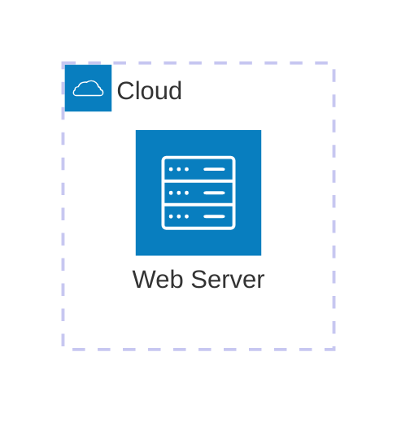

# Node: Web Server
Accepts HTTP request on port: 3000 and respond with a simple message

## Includes
* relevant comments
* logic to hanlde graceful shutdown

## Technologies
- Developed using NodeJS v24
- Using npm v11 for package handling
- Usign Docker to build image and run as docker container

## Diagram



## How-to: Run

Http server will listen for requests here:
```
http://localhost:3000/
```

### Local
```
npm run start
```

### Docker
Build docker image with a predefined name "first-web-app"
```
npm run docker-build
```

Run image as a docker container
```
npm run docker-run
```

Stop container and removes it from local registry
```
npm run docker-destroy
```
